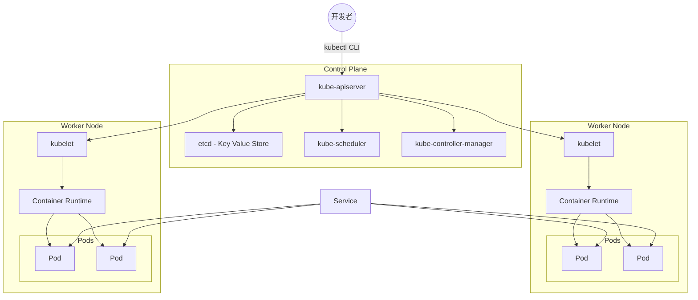

# Kubernetes 架构概述

Kubernetes 采用客户端 - 服务器模型运行，其中集中式的控制平面（Control Plane）负责管理集群的状态，而一组工作节点（Worker Nodes）则运行工作负载。从高层次来看，用户（通常是开发者）通过命令行工具或 API 与 Kubernetes 集群交互。控制平面决定哪些工作负载应该运行在哪些节点上，监控集群的健康状态，并确保达到期望的状态。工作节点以 Pod（一组一个或多个容器）的形式托管你的应用程序，并提供运行这些应用程序所需的计算和存储资源。

## 控制平面（Control Plane）

这是集群的“大脑”，由多个组件组成，共同协作以管理整个系统：

- **kube-apiserver (API)**：作为集群的前门。所有管理命令和资源请求都通过它传递。
- **etcd (Key Value Store)**：存储所有配置数据和集群的当前状态。如果丢失 etcd 数据，集群的状态也会丢失。
- **kube-scheduler (SCH)**：根据资源需求、约束和策略将 Pod 分配到节点。
- **kube-controller-manager (CTLM)**：运行多种控制器，持续调整集群状态，确保实际状态与部署和配置中定义的期望状态一致。

## 节点（工作机器）

节点是工作负载运行的地方。每个节点包含：

- **kubelet (KLT)**：节点级别的代理，与控制平面通信。它确保 Pod 正在运行，并将其状态报告回控制平面。
- **容器运行时（Container Runtime, CR）**：运行和管理容器的软件（例如 Docker 或 containerd）。它在 Pod 中创建和管理容器化应用程序。

## Pod

Pod 是 Kubernetes 中最小的可部署单元，通常代表一个正在运行的应用程序实例。Pod 可以包含一个或多个容器，这些容器共享相同的网络命名空间和存储卷。

## 服务（Service）

服务是一种抽象，定义了一组逻辑 Pod 以及访问它们的策略。服务提供稳定的 IP 地址、DNS 名称和负载均衡，确保外部消费者和其他集群组件能够可靠地连接到你的应用程序——即使 Pod 在节点之间移动或在扩展或滚动更新期间被替换。

## 与集群交互

- 开发者和管理员通过 **kube-apiserver** 与集群交互，通常使用 `kubectl` 或其他 Kubernetes 客户端。
- 当部署新应用程序时，控制平面组件（调度器、控制器）会将 Pod 分配到适当的节点。
- 每个节点上的 kubelet 确保 Pod 健康并按指令运行。
- 服务将流量路由到正确的 Pod，使客户端能够访问应用程序，而无需跟踪 Pod 位置的变化。

在图中：

- 开发者通过 CLI 工具（如 `kubectl`）与 `kube-apiserver` (API) 交互。
- 控制平面组件（API、etcd、调度器、控制器管理器）管理集群状态并编排工作负载。
- 每个工作节点运行一个 kubelet 和一个容器运行时，托管多个 Pod。
- 服务将外部或内部流量路由到正确的 Pod，提供一个稳定的端点，抽象了 Pod 生命周期和 IP 变化的复杂性。

这种心智模型帮助你理解在检查集群状态、检查节点健康、列出 Pod 和查询服务时所看到的内容——这些概念将在你继续使用 `kubectl` 命令探索 Kubernetes 时得到应用。
