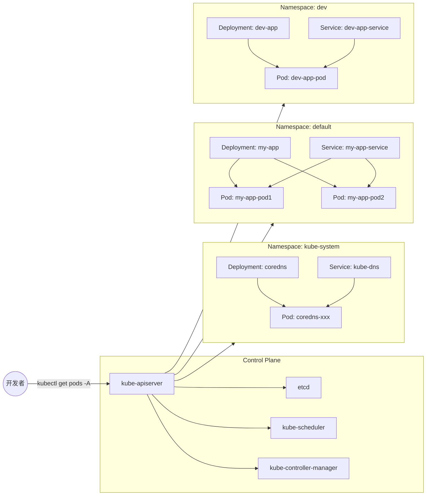

# 检查基本集群资源

在这一步中，你将检查 Kubernetes 的基本资源——例如 Pod、Deployment 和 Service——跨所有命名空间（namespace）。通过使用 `-A`（或 `--all-namespaces`）标志，你将看到资源在整个集群中的组织方式。这是介绍和理解 Kubernetes 中**命名空间（Namespace）**概念的绝佳机会。

**命名空间：资源隔离**

命名空间是 Kubernetes 集群中的逻辑分区，用于帮助组织和管理资源。它们提供了一种将相关对象分组并在细粒度级别应用策略、访问控制和资源配额的方式。通过将资源分离到不同的命名空间中，你可以：

- **提高组织性**：将相关的工作负载分组（例如按项目、团队或环境——如开发、测试和生产）。
- **增强安全性和访问控制**：限制哪些用户或服务账户可以查看或修改特定命名空间中的资源。
- **简化资源管理**：更有效地应用资源限制、网络策略和其他集群范围的配置。

当你使用 `-A`（或 `--all-namespaces`）标志列出资源时，你会注意到属于 Kubernetes 系统的组件位于 `kube-system` 命名空间中，该命名空间专用于集群级基础设施。用户创建的应用程序通常位于 `default` 命名空间或你定义的其他自定义命名空间中。

**命名空间和资源**



在图中：

- **控制平面**管理整个集群，与节点通信并控制工作负载。
- **命名空间**（如 `kube-system`、`default` 和 `dev`）在集群内逻辑上分离资源。
  - `kube-system` 包含系统级组件，如 CoreDNS 和 kube-dns。
  - `default` 通常用于一般工作负载，这里以 `my-app` 部署为代表。
  - `dev` 可能代表开发环境，与生产工作负载隔离。

通过查看所有命名空间中的资源，你可以全面了解这些逻辑分区如何帮助维护一个组织良好且安全的集群。

**示例：**

列出所有命名空间中的所有 Pod：

```bash
kubectl get pods -A
```

示例输出：

```
NAMESPACE     NAME                               READY   STATUS    RESTARTS      AGE
kube-system   coredns-787d4945fb-j8rhx           1/1     Running   0             20m
kube-system   etcd-minikube                      1/1     Running   0             20m
kube-system   kube-apiserver-minikube            1/1     Running   0             20m
kube-system   kube-controller-manager-minikube   1/1     Running   0             20m
kube-system   kube-proxy-xb9rz                   1/1     Running   0             20m
kube-system   kube-scheduler-minikube            1/1     Running   0             20m
kube-system   storage-provisioner                1/1     Running   1 (20m ago)   20m
```

在这里，你可以看到所有与系统相关的 Pod 运行在 `kube-system` 命名空间中。如果你在其他命名空间中有其他部署或服务，它们也会出现在此列表中，每个资源都清楚地由其命名空间限定。

列出所有命名空间中的所有 Deployment：

```bash
kubectl get deployments -A
```

示例输出：

```
NAMESPACE     NAME      READY   UP-TO-DATE   AVAILABLE   AGE
kube-system   coredns   1/1     1            1           20m
```

`coredns` 部署位于 `kube-system` 命名空间中。

获取所有命名空间中所有资源的综合视图：

```bash
kubectl get all -A
```

该命令显示不同命名空间中的 Pod、服务和部署的概览，帮助你了解这些资源在集群中的分布情况。

**关键要点：**

- **命名空间**在 Kubernetes 集群中提供逻辑隔离和组织。
- 不同的 Kubernetes 组件和资源被组织到特定的命名空间中（例如，`kube-system` 用于核心服务，`default` 用于一般工作负载，以及你创建的其他命名空间）。
- 通过使用 `-A` 查看所有命名空间中的资源，你可以深入了解集群的结构以及命名空间如何作为资源组织和访问控制的边界。

通过理解命名空间如何作为逻辑环境运行，你可以更好地导航、隔离和管理你的工作负载及相关集群资源，尤其是在扩展部署并向 Kubernetes 环境引入更多复杂性时。
