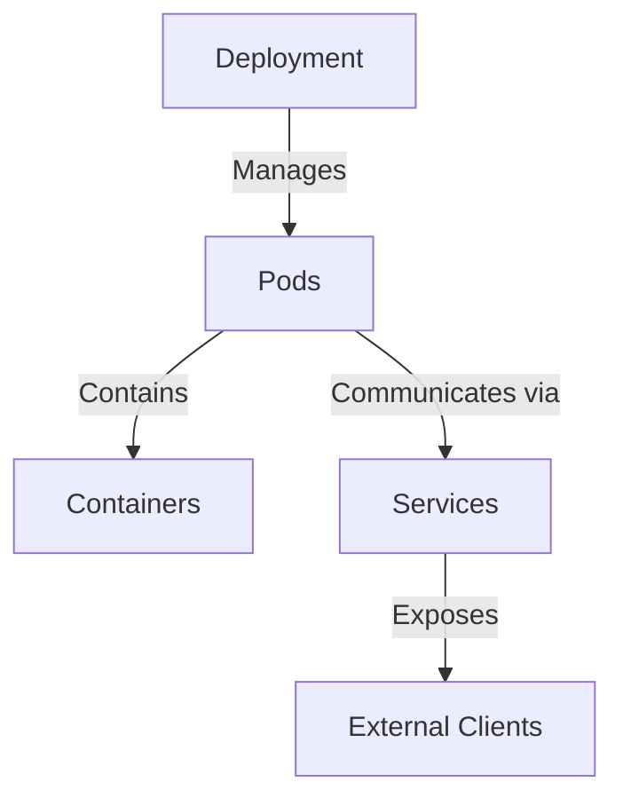

# 创建一个简单的 YAML Manifest

在你创建第一个 YAML manifest 之前，理解你将要使用的关键 Kubernetes 对象非常重要。这些对象是在 Kubernetes 中管理和编排应用程序的构建块。

## 理解 Kubernetes 对象

- **Pod**: Kubernetes 中最基本 的单元。一个 Pod 就像一个盒子，可以包含一个或多个容器。这些容器在 Pod 中共享相同的网络和存储。将 Pod 视为代表你应用程序的单个实例。
- **Deployment**: Deployment 用于管理 Pod。它们确保所需数量的 Pod 副本始终在运行。如果一个 Pod 失败，Deployment 会自动替换它。Deployment 还以可控的方式处理应用程序的更新，例如滚动更新。
- **Service**: Service 提供了一种稳定 的方式来访问运行在 Pod 中的应用程序。由于 Pod 可以被创建和销毁，它们的 IP 地址可能会发生变化。Service 提供了一个固定的 IP 地址和 DNS 名称，始终指向它管理的 Pod 集合。这使得你的应用程序的其他部分或外部用户能够可靠地访问你的应用程序，而无需跟踪单个 Pod 的 IP。

下面是一个图示，说明了这些对象之间的关系：



理解这些对象至关重要，因为你将使用 YAML manifest 来定义它们的期望状态和配置。

## YAML Manifest 概述

Kubernetes 中的 YAML manifest 是一个用 YAML 格式编写的文件，它描述了你想要创建或管理的 Kubernetes 对象。YAML 是一种人类可读的数据序列化语言。在 Kubernetes manifest 中使用 YAML 有几个优点：

1. **声明式管理**: 你在 YAML 文件中描述资源的 *期望状态*（例如，“我希望我的应用程序运行 3 个副本”）。然后 Kubernetes 会努力使实际状态与你的期望状态匹配。这被称为声明式管理。
2. **版本控制**: YAML 文件是基于文本的，可以轻松地存储在 Git 等版本控制系统中。这允许你随着时间的推移跟踪 Kubernetes 配置的更改，回滚到以前的配置，并与他人协作。
3. **可重用性和可移植性**: 你可以在不同的环境（开发、测试、生产）中重用 YAML manifest，只需进行少量更改。这使得你的部署更加一致和可重现。

现在你已经理解了 Kubernetes 对象和 YAML manifest 的基础知识，你就可以创建你的第一个 manifest 了。

## 创建一个 YAML Manifest

首先，导航到你的项目目录。假设你的主目录（`~`）下有一个 `project` 目录。如果还没有，请立即使用 `mkdir project` 创建它。然后，使用 `cd project` 更改当前目录：

```bash
cd ~/project
```

接下来，创建一个新目录来存储你的 Kubernetes manifest。我们将其命名为 `k8s-manifests`。使用 `mkdir` 命令创建目录，然后使用 `cd` 进入该目录：

```bash
mkdir -p k8s-manifests
cd k8s-manifests
```

现在，你将创建你的第一个 YAML manifest 文件。让我们从一个简单的 NGINX Pod manifest 开始。NGINX 是一个流行的 Web 服务器。我们将创建一个运行单个 NGINX 容器的 Pod。使用 `nano` 文本编辑器创建一个名为 `nginx-pod.yaml` 的文件：

```bash
nano nginx-pod.yaml
```

`nano` 是一个在你的终端中运行的简单文本编辑器。当 `nano` 打开后，将以下内容粘贴到文件中：

```yml
apiVersion: v1
kind: Pod
metadata:
  name: nginx-pod
  labels:
    app: nginx
spec:
  containers:
    - name: nginx
      image: nginx:latest
      ports:
        - containerPort: 80
```

让我们理解这个 YAML manifest 的每个部分：

- **`apiVersion: v1`**: 指定用于创建此对象的 Kubernetes API 版本。`v1` 是核心 API 组，用于 Pod、Service 和 Namespace 等基本对象。
- **`kind: Pod`**: 表明你正在定义一个 Pod 资源。
- **`metadata:`**: 包含有关 Pod 的数据，例如其名称和标签。
  - **`name: nginx-pod`**: 将 Pod 的名称设置为 `nginx-pod`。这就是你将在 Kubernetes 中引用此 Pod 的方式。
  - **`labels:`**: 标签是附加到对象的键值对。它们用于组织和选择对象子集。在这里，我们为这个 Pod 添加了一个 `app: nginx` 标签。
- **`spec:`**: 描述 Pod 的期望状态。
  - **`containers:`**: 要在 Pod 中运行的容器列表。在这种情况下，我们只有一个容器。
    - **`- name: nginx`**: 将容器的名称设置为 `nginx`。
    - **`image: nginx:latest`**: 指定要使用的容器镜像。`nginx:latest` 指的是 Docker Hub 中 NGINX Docker 镜像的最新版本。
    - **`ports:`**: 此容器将公开的端口列表。
      - **`- containerPort: 80`**: 指定容器将公开端口 80。端口 80 是标准的 HTTP 端口。

粘贴内容后，保存文件并退出 `nano`。为此，请按 `Ctrl+X`（退出），然后键入 `Y`（表示保存），最后按 `Enter` 确认文件名并保存。

现在你已经创建了 `nginx-pod.yaml` 文件，你需要将其应用到你的 Kubernetes 集群以创建 Pod。使用 `kubectl apply` 命令和 `-f` 标志，该标志指定包含 manifest 的文件：

```bash
kubectl apply -f nginx-pod.yaml
```

此命令将 manifest 发送到你的 Kubernetes 集群，Kubernetes 将按照定义创建 Pod。你应该会看到类似以下的输出：

```
pod/nginx-pod created
```

要验证 Pod 是否已创建并正在运行，请使用 `kubectl get pods` 命令。这将列出默认命名空间中的所有 Pod。你也可以使用 `kubectl describe pod nginx-pod` 来获取 `nginx-pod` 的详细信息。运行这些命令：

```bash
kubectl get pods
kubectl describe pod nginx-pod
```

`kubectl get pods` 的示例输出：

```
NAME        READY   STATUS    RESTARTS   AGE
nginx-pod   1/1     Running   0          1m
```

此输出显示 `nginx-pod` 是 `READY`（1 个容器中有 1 个已准备好）并且其 `STATUS` 是 `Running`。这意味着你的 NGINX Pod 已成功创建并正在运行。

现在，让我们创建一个更复杂资源的 manifest：一个 Deployment。Deployment 将管理一组 Pod，确保所需数量的副本正在运行。使用 `nano` 创建一个名为 `nginx-deployment.yaml` 的新文件：

```bash
nano nginx-deployment.yaml
```

将以下内容粘贴到 `nginx-deployment.yaml` 中：

```yml
apiVersion: apps/v1
kind: Deployment
metadata:
  name: nginx-deployment
  labels:
    app: nginx
spec:
  replicas: 3
  selector:
    matchLabels:
      app: nginx
  template:
    metadata:
      labels:
        app: nginx
    spec:
      containers:
        - name: nginx
          image: nginx:latest
          ports:
            - containerPort: 80
```

让我们重点介绍与 `nginx-pod.yaml` manifest 相比的关键区别和新增部分：

- **`apiVersion: apps/v1`**: 对于 Deployment，你使用 `apps/v1` API 版本，它是 `apps` API 组的一部分，用于处理更高级别的应用程序管理资源。
- **`kind: Deployment`**: 表明你正在定义一个 Deployment 资源。
- **`spec:`**: Deployment 的 `spec` 部分更复杂，因为它定义了 Deployment 如何管理 Pod。
  - **`replicas: 3`**: 这是新的。它指定你希望运行 3 个副本（副本）的 Pod。Deployment 将确保始终有 3 个 Pod 符合 `template` 中定义的标准。
  - **`selector:`**: Deployment 使用选择器来识别它应该管理哪些 Pod。
    - **`matchLabels:`**: 定义 Pod 必须具有的标签才能被此 Deployment 选择。在这里，它选择具有 `app: nginx` 标签的 Pod。
  - **`template:`**: `template` 定义了 Deployment 将用于创建新 Pod 的 Pod 规范。它本质上与我们 `nginx-pod.yaml` 示例中的 Pod 定义相同，包括 `metadata.labels` 和 `spec.containers`。**重要提示**: 此处 `template.metadata.labels` 中定义的标签必须与 `selector.matchLabels` 匹配，以便 Deployment 可以管理这些 Pod。

保存并退出 `nano`（Ctrl+X，Y，Enter）。

现在，将此 Deployment manifest 应用到你的集群：

```bash
kubectl apply -f nginx-deployment.yaml
```

你应该会看到类似以下的输出：

```
deployment.apps/nginx-deployment created
```

验证 Deployment 及其创建的 Pod。使用 `kubectl get deployments` 检查 Deployment 状态，并使用 `kubectl get pods` 查看 Pod。

```bash
kubectl get deployments
kubectl get pods
```

示例输出：

```
NAME               READY   UP-TO-DATE   AVAILABLE   AGE
nginx-deployment   3/3     3            3           1m

NAME                                READY   STATUS    RESTARTS   AGE
nginx-deployment-xxx-yyy            1/1     Running   0          1m
nginx-deployment-xxx-zzz            1/1     Running   0          1m
nginx-deployment-xxx-www            1/1     Running   0          1m
```

- `kubectl get deployments` 显示 `nginx-deployment` 的 `READY` 为 3/3，`UP-TO-DATE` 为 3，`AVAILABLE` 为 3。这意味着 Deployment 已成功创建并正在管理 3 个 Pod，并且所有这些 Pod 都已准备好并可用。
- `kubectl get pods` 现在列出了三个名称以 `nginx-deployment-` 开头的 Pod。这些是由你的 `nginx-deployment` 创建和管理的 Pod。
