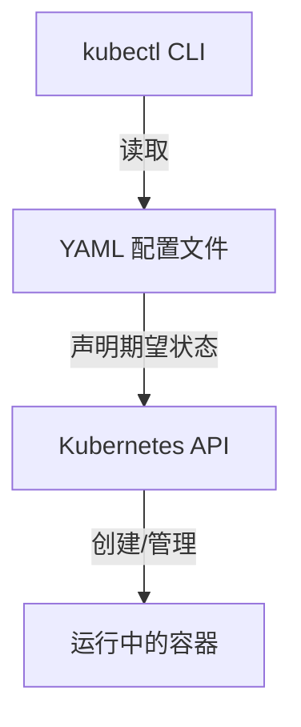

# 创建并检查 Pod

在开始之前，让我们先了解 YAML 在 Kubernetes 中的工作原理：



Kubernetes 中的 YAML 文件充当“基础设施即代码”：

- 可以将其视为告诉 Kubernetes 你想要什么的“菜单”
- 以人类可读的格式描述你期望的系统状态
- 可以进行版本控制以支持团队协作

让我们创建第一个 YAML 文件。创建 `simple-pod.yaml`：

```bash
nano ~/project/simple-pod.yaml
```

添加以下内容：

```yaml
# --- YAML 文件开头 ---
# 1. 告诉 Kubernetes 使用哪个 API 版本
apiVersion: v1
# 2. 声明我们要创建的资源类型
kind: Pod
# 3. 设置此资源的元数据
metadata:
  name: nginx-pod # Pod 的名称
  labels: # 标签帮助我们查找和组织 Pod
    app: nginx
# 4. 定义 Pod 应包含的内容
spec:
  containers: # Pod 可以运行一个或多个容器
    - name: nginx # 容器的名称
      image: nginx:latest # 使用的容器镜像
      ports: # 暴露的端口
        - containerPort: 80 # Nginx 默认使用端口 80
```

YAML 文件的结构类似于树：

```
Pod (根)
├── metadata (分支)
│   ├── name (叶子)
│   └── labels (叶子)
└── spec (分支)
    └── containers (分支)
        └── - name, image, ports (叶子)
```

创建 Pod：

```bash
kubectl apply -f simple-pod.yaml # -f 表示从文件读取
```

此命令将：

1. 读取你的 YAML 文件
2. 将其发送到 Kubernetes API
3. Kubernetes 将努力实现你描述的状态

验证 Pod 的创建：

```bash
kubectl get pods
```

你应该会看到：

```
NAME        READY   STATUS    RESTARTS   AGE
nginx-pod   1/1     Running   0          30s
```

READY 下的 "1/1" 表示 Pod 中的一个容器已准备就绪。STATUS 下的 "Running" 表示你的第一个 YAML 配置成功了！

> 💡 **专业提示**：
>
> - YAML 中的缩进至关重要——使用空格，而不是制表符
> - 使用 `kubectl explain pod` 查看字段文档
> - 始终添加注释以提高可维护性

要获取有关 Pod 的详细信息：

```bash
kubectl describe pod nginx-pod
```

此命令提供了大量信息，包括：

- Pod 运行的节点
- Pod 的 IP 地址
- Pod 中的容器
- 与 Pod 相关的最新事件

这些信息对于调试和理解应用程序的状态至关重要。
