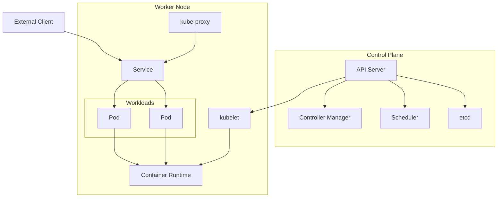

# 总结

在本实验中，我们通过检查 Kubernetes 的关键组件及其交互，探索了 Kubernetes 的架构。我们使用 Minikube 启动了一个 Kubernetes 集群，检查了控制平面和节点组件，创建了一个 Pod 来运行应用程序，使用 Service 暴露了应用程序，并最终访问了该应用程序。

我们学习了以下内容：

- 控制平面组件，如 API Server、调度器（Scheduler）和控制器管理器（Controller Manager）
- 节点组件，如 kubelet 和 kube-proxy
- Pod 作为 Kubernetes 中最小的可部署单元
- Service 作为暴露应用程序的一种方式

这种实践经验为理解 Kubernetes 架构提供了坚实的基础。请记住，Kubernetes 是一个复杂的系统，包含许多动态部分，如果你没有立即理解所有内容，这是正常的。随着你继续使用 Kubernetes，这些概念将变得更加熟悉和直观。

你 Kubernetes 学习之旅的下一步可能包括学习如何使用 Deployment 管理应用程序的多个副本、使用 ConfigMap 和 Secret 管理配置，以及使用 Persistent Volume 进行数据存储。继续探索，祝你 Kubernetes 之旅愉快！
